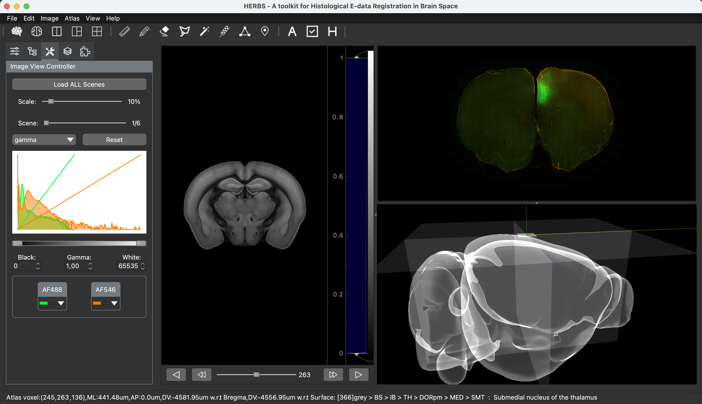

# HERBS
A Python-based GUI for Histological E-data Registration in Brain Space


HERBS is an open source, extensible, intuitive and interactive software platform for image visualisation and image registration. Where the image registration is the process of identifying a spatial transformation that maps images to a template such that corresponding anatomical structures are optimally aligned, or in other words, a voxel-wise ‘correspondence’ is established between the images and template.

HERBS has been tested on Windows (10 and 11), MacOSx (Big Sur - Monterey), Linux (Kubuntu 18.04, Ubuntu 22.04 LTS), and as a python application, it should run in all environments supporting python 3.8.10-3.10.4 / 3.9.0 with NumPy < 1.23 and PyQt5 >= 5.14.2 as a GUI framework. For details, please see HERBS CookBook (coming soon).

HERBS provides users:

- 2D and 3D visualisation of brain atlas volume data and arbitrary slicing.
- Image registration with interactive local elastic deformation methods in current version.
- 2D and 3D visualisation of user defined data.

## Install

```python
$ pip install herbs
```

Please install the newest version of HERBS.

## Usage

```python
import herbs
herbs.run_herbs()
```

After running the above scripts, a GUI window will pop up. Users can download atlas and upload images for further process,

</img>

For more information, please read HERBS CookBook (coming soon) or check the Tutorial folder for corresponding functionalities.

## Some Pre-Requirement Issues

- In order to run HERBS properly, 64 bit operating systems and 64 bit Python are required.

- 3D visualisation in HERBS depends on OpenGL, if you face to the problem that no OpenGL is installed on your machine, please see (https://www.opengl.org) to download and install accordingly. 

- For the current version of HERBS, Python is required to be installed. Please see (https://www.python.org) for downloading.

- If you would like to install HERBS through terminal, **pip** is required. 
	- Check if pip is installed, `pip --version` or `pip help`.
	- Use `python3 -m ensurepip` for MacOS to install pip.
	- Use `curl https://bootstrap.pypa.io/get-pip.py -o get-pip.py` to download requiring file for installing pip on Windows and `python get-pip.py` to install pip.
	- Please update pip to the newest version before installing HERBS.

- We strongly recommend users to use Python and install packages with virtual environment. For no-coders, we strongly recommend to use IDE to create environment at the moment. A desktop app of HERBS is coming soon.   

### 
Please report your issues: https://github.com/JingyiGF/HERBS/issues. Please have a good description (maybe a screenshot or an error message). Any feedback welcome!

Please feel free to start any discussion: https://github.com/JingyiGF/HERBS/discussions.

## Finally
HERBS is 'always' in development, please check updates every time before you use it.


Hope this tool makes your amazing research life more tasty :-)
