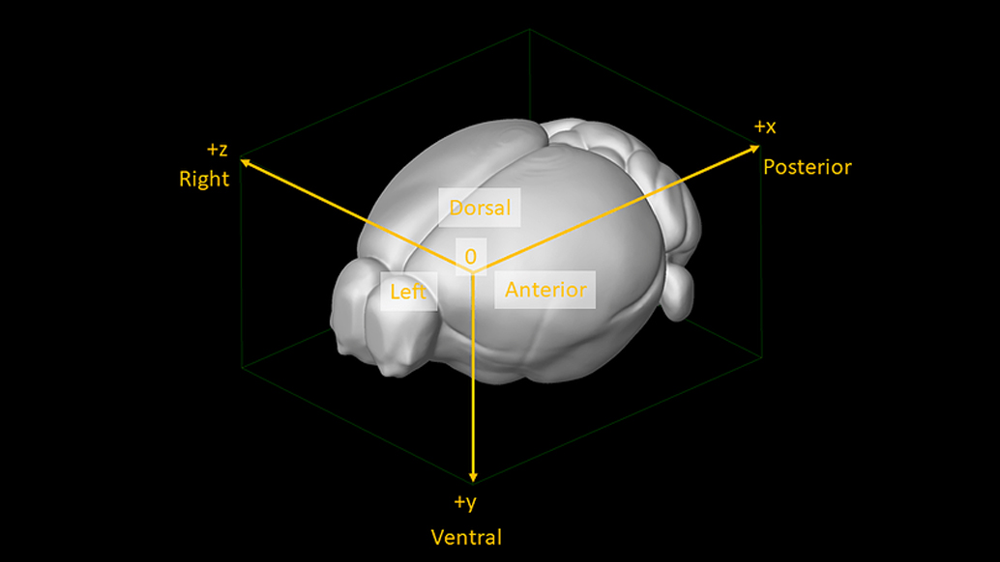
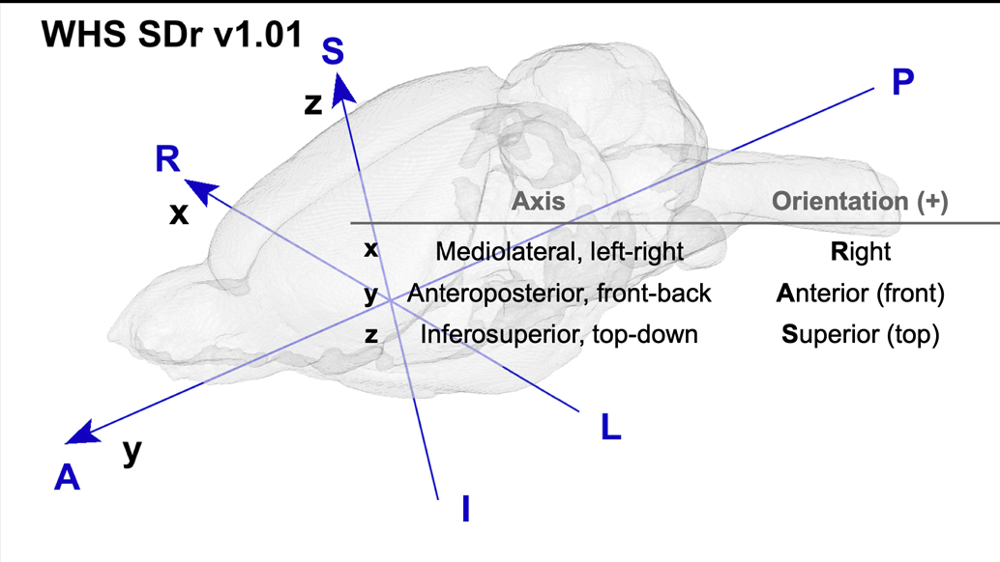
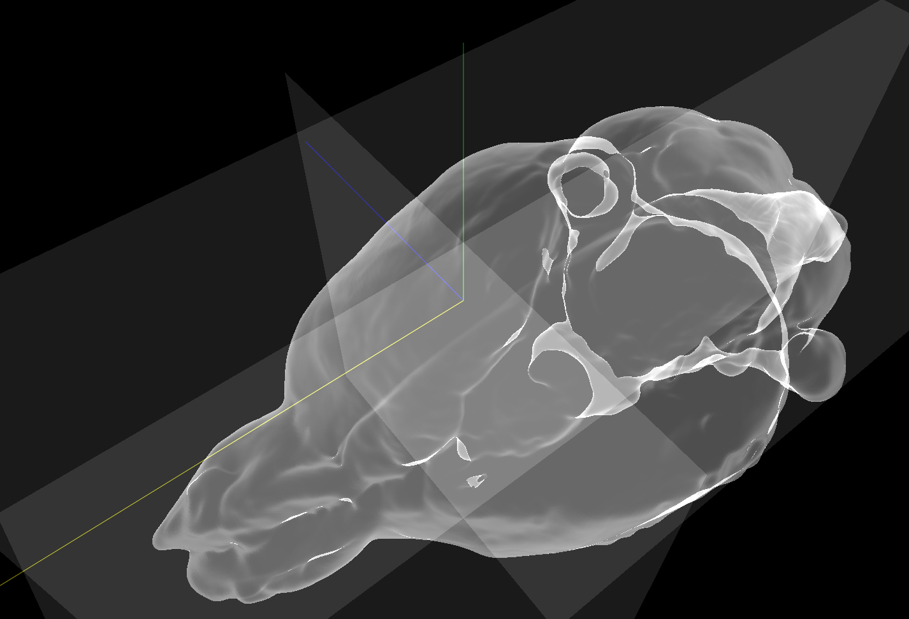

## About Atlas through HERBS

HERBS allows users to download Waxholm Rat altas and Allen Mouse atlas and process multiple volume brain atlases. Different atals has been developed based on different coordinates systems. In ohter words, the X-axis/Y-axis/Z-axis has different meaning and points different directions from atlas to atlas.

Besides the coordinates that atlases deployed, HERBS has its Internal coordinates also. In this page, I will brifely talk about the differeces in coordinates between popular atlases and HERBS internal.

### Allen Mouse Atlas
In Allen mouse atlas, X-axis is pointing from Anterior to posterior, Y-axis Dorsal to ventral and Z-axis Left to Right, as shown in the screenshot from Allen webpage
https://community.brain-map.org/t/how-to-switch-between-the-3-coordinate-systems-of-mouse-connectivity/952

### Waxholm Rat Atlas
In Waxholm rat atlas, X-axis pointing from Left to Right, Y-axis Posterior to Anterior and Z-axis Bottom to Top (Interior to Superior), as shown in the screenshot from NRTIC webpage
https://www.nitrc.org/docman/view.php/1081/2094/Coordinate_system_orientation_v1-v1.01.pdf

### HERBS Internal
HERBS internal 3D coordinates is the same as Waxholm Rat Atlas. However, the 2D coordinates are different than that in 3D in order to provide a user friendly 2D slice orientation. From 3D to 2D, we change x -> y, y -> z and z -> x, with or without inverting axises. All internal calculations occur in 2D planes will be translated back into 3D coordinates during calculations that happens in HERBS automatically. 

All atlas that has different coordinates will be transposed to match HERBS internal coordinates.

If you are interested in this part, please first read the Tutorial on "upload and process user defined atlases".

### About Bregma
For Allen Mouse Atlas, the bregma is not given. Therefore HERBS provide the freedom that users can set their own bregma through atlas processor when processing the downloaded atlas. The default value of the bregma in the processor is set to be (0, 0, 0) in original coordinates, which indicates the users defined bregma is not given. When processing the atlas, the bregma will be set to (x_size/2, 0, z_size/2) in the original coordinates, but using HERBS internal for calculation and transform back to the original. 

For example, the 25um atlas volume in HERBS 3D has original shape (528, 320, 456) and HERBS internal shape (456, 528, 320). If Bregma is not set specifically, HERBS will set it to be (263, 0, 228) in Allen original, which is equavalent to HERBS 2D internal (0, 228, 263).