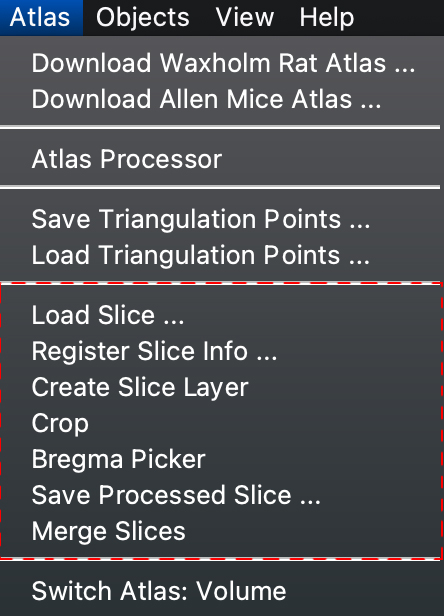
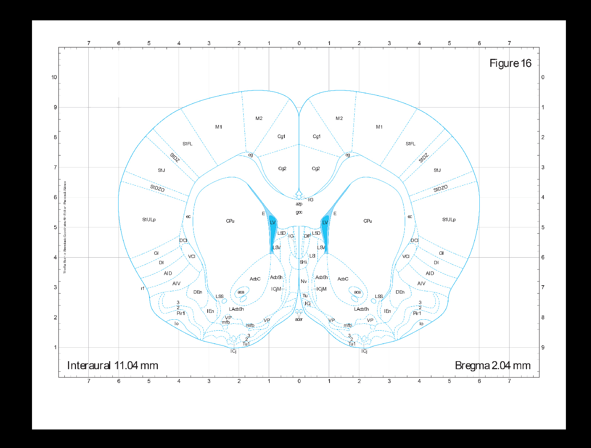
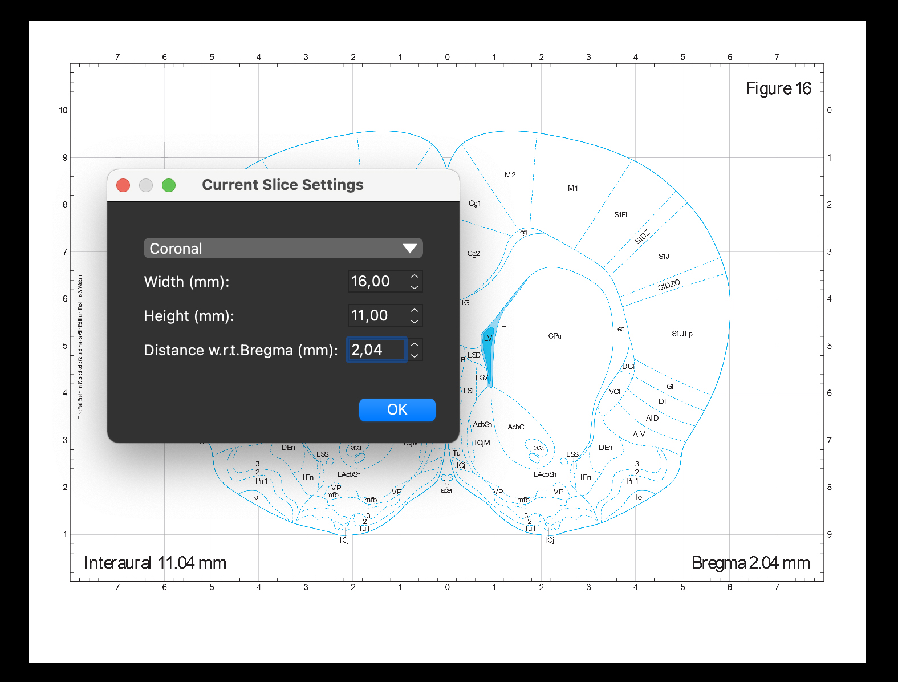
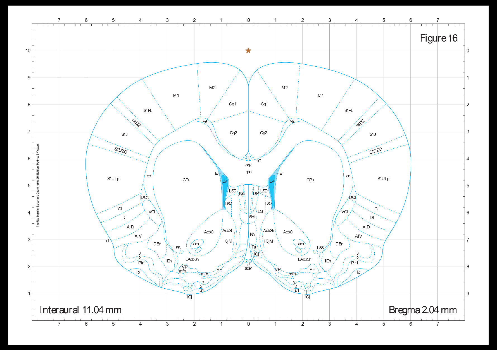
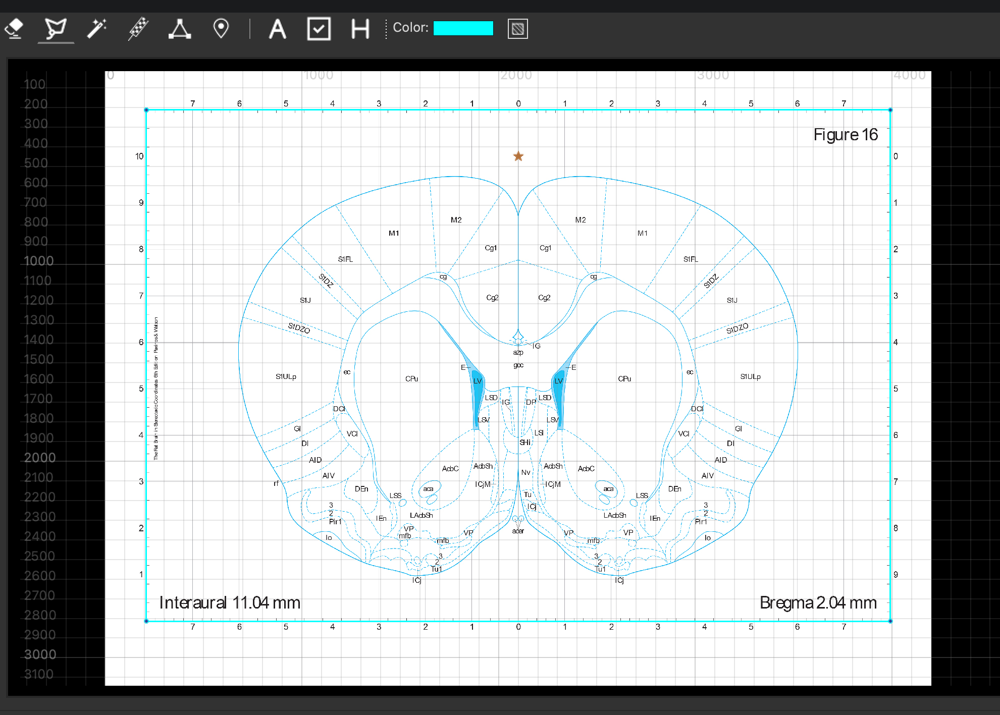
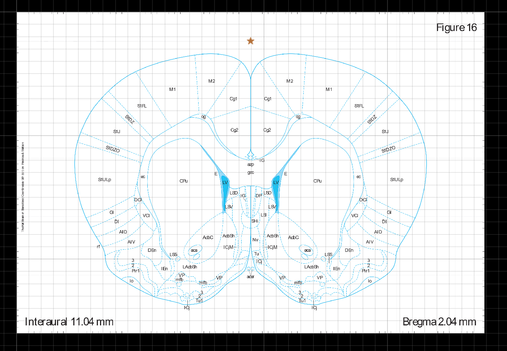
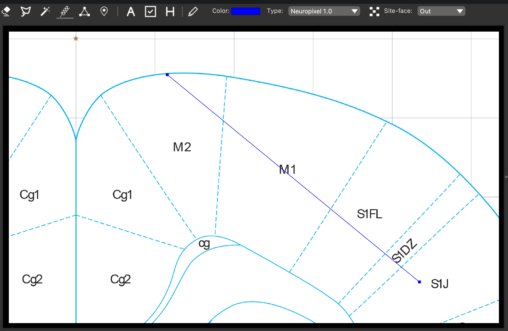
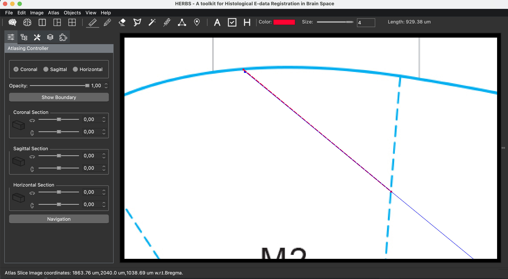

## Upload Slice Atlas

Besides volume atlases, HERBS also supports for slice/image atlas 
as long as the user has the legal license to own a PDF copy of the atlas.

In this tutorial, we use one copy from PAXINOS and WATSON's Rat Atlas Book for illustration.

The most important part in HERBS to upload a single book page image as one atlas slice is 
in the forth blocks in the <b>Atlas</b> drop-down menu.

1. Click <b>Load Slice</b> to select the image one would like to upload. 
Afterwards, slice atlas window will pop up together with the image.
One can find all the information about this atlas slice on the image.
For example, the AP-distance between Bregma and this slice is 2.04 mm,
the width of interesting area is 16 mm and height is 11 mm.

2. Click <b>Register Slice Info</b>, a <em>Current Slice Settings</em> window will pop up. 
Register the information found before and press 'OK' button.

3. Click <b>Bregma Picker</b> and click on the image window to select the location of Bregma'. 
Note: Bregma' does not contain the AP value of the Bregma for this slice.

4. Since the image contains a white margin which is not useful, 
we need to remove it. Check <b>Lasso</b> tool button and select the interesting area.

5. After the lasso path is closed, Click <b>Atlas</b> menu -> <b>Crop</b> menu. 
The white margin is removed.

6. The following processes are very different from using volume atlases. 
For example, we would like to design a probe trajectory.

7. Instead of adding pieces and merging probes, 
we have to use the <b>Ruler</b> tool to get the probe length in each brain region. 
For example, after checking the <b>Ruler</b> tool, 
we click along the probe at where the probe enters M2 and at where the probe leaves M2. 
The length of probe in M2 will be shown in the Tool Bar.

