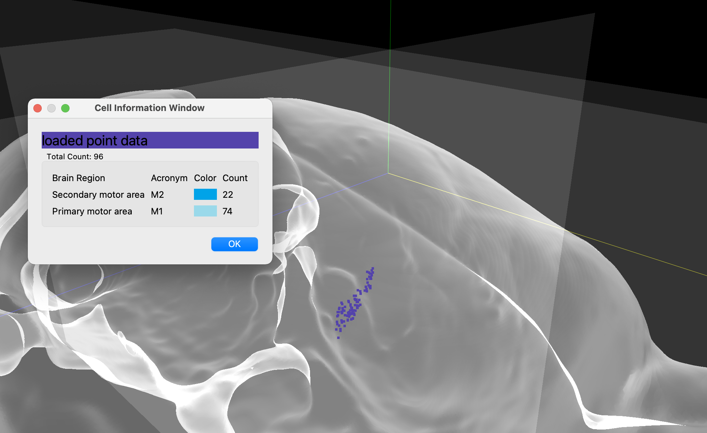

## Upload External Cell Points

There are many excellent software for helping neuroscientists to automatically find cell coordinates in an atlas space.
HERBS allows users to upload the cell points that produced from other software to obtain the information and visualise them.

To do so, the points cell datasets have to be saved either in a numpy form (*.npy) or a pickle form (*.pkl). 
The points data has to be a numpy.ndarray with size (n, 3), where n is the number of points.
The points coordinates have to be in atlas space. 
For illustration we assume the points coordinates are in Waxholm Rat Atlas space (atlas has volume size (512, 1024, 512)). 
Therefore the values in the first column of the dataset are in range [0, 512], 
meanwhile the second and third are in range [0, 1024] and [0, 512], respectively.

<table align="center">
    <tr>
        <td>
            321
        </td>
        <td>
            674
        </td>
        <td>
            283
        </td>
    </tr>
    <tr>
        <td>
            323
        </td>
        <td>
            674
        </td>
        <td>
            284
        </td>
    </tr>
    <tr>
        <td>
            ...
        </td>
        <td>
            ...
        </td>
        <td>
            ...
        </td>
    </tr>
    <tr>
        <td>
            342
        </td>
        <td>
            684
        </td>
        <td>
            301
        </td>
    </tr>
</table>

1. Click <b>File</b> menu -> <b>Load External Data</b> -> Cells. 
A file dialog will pop up and select the data file you would like to upload.

2. After selecting the data file, go to <b>Object View Controller</b> panel, a cell piece is added there.

3. Click <b>Merge Cells</b> button, and view the information by clicking the <b>Information</b> button 
and view 3D by clicking <b>View</b> menu -> <b>3D window</b>.

