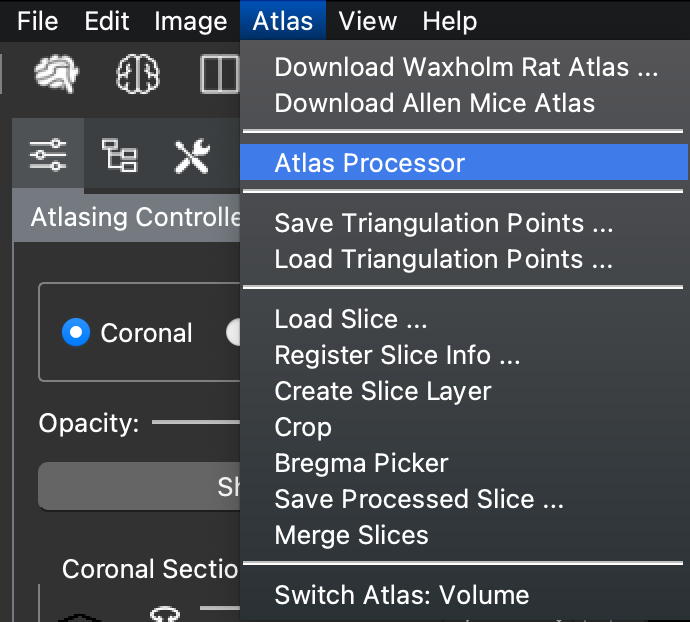
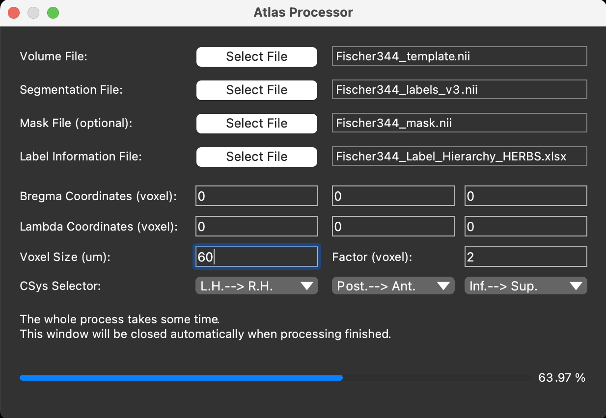
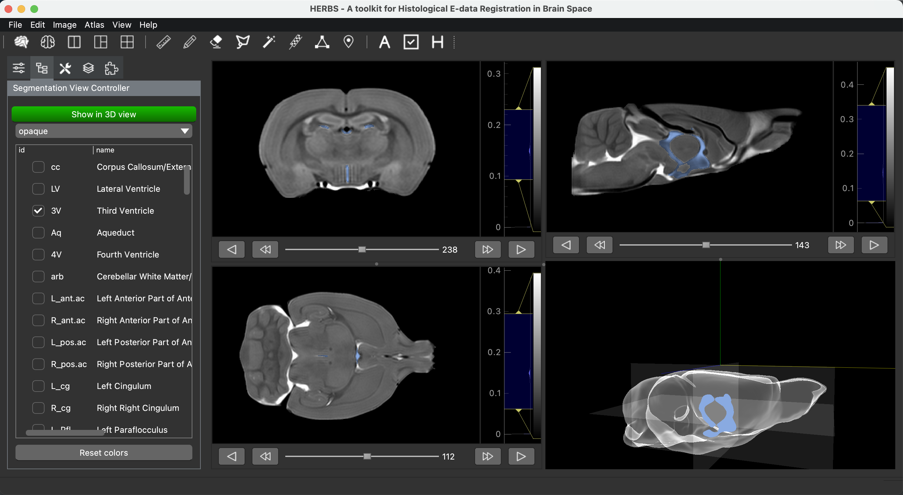

## Upload and Process User Defined Atlases

HERBS was designed in a way that users can upload their favorite volume atlases 
besides the Waxholm Rat atlas and Allen mouse CCF atlas. 

In order to do so, users need to have a volume atlas template file
with a corresponding segmentation/label file (some atlas also has a mask file) 
and a file to describe the label information and hierarchy. 
All of these files can be found from other atlas producer if users do not use their home-made atlases.

<table width="100%">
<tr>
<td align="center" width="40%">
volume atlas template file  
(volume file)
</td>
<td>
For example: an MRI scan.
</td>
</tr>
<tr>
<td align="center">
segmentation/label file  
(label file)
</td>
<td>
Brain region segmentation. Each region is indicated by an integer.
</td>
</tr>
<tr>
<td align="center">
mask file
</td>
<td>
To clean the MRI scan, so that the skull part will not be displayed.
</td>
</tr>
<tr>
<td align="center">
label info file
</td>
<td>
Contains the brain region names, label integers, hierarchy and so on.
</td>
</tr>
</table>

For HERBS to understand the label information included in the label info file from different atlases, 
we require users to prepare an Excel file which has a uniform format based on the label info file. 
Here we show an example with the minimum requirement of the compulsory information and format that HERBS needs.
If users would like to specify colors for different brain regions, 
an extra column need to be added with column name 'color_hex_triplet'. 
For a .xlsx file, only the first sheet can be read. 

<table width="100%">
    <tr>
        <td>
            id
        </td>
        <td>
            name
        </td>
        <td>
            acronym
        </td>
        <td>
            parent_id
        </td>
        <td>
            structure_id_path
        </td>
    </tr>
    <tr>
        <td>
            99999
        </td>
        <td>
            Brain
        </td>
        <td>
            Brain
        </td>
        <td>
            -1
        </td>
        <td>
            /99999/
        </td>
    </tr>
    <tr>
        <td>
            1
        </td>
        <td>
            A
        </td>
        <td>
            A
        </td>
        <td>
            99999
        </td>
        <td>
            /99999/1/
        </td>
    </tr>
    <tr>
        <td>
            21
        </td>
        <td>
            dfsasdfad
        </td>
        <td>
            dfs
        </td>
        <td>
            1
        </td>
        <td>
            /99999/1/21/
        </td>
    </tr>
    <tr>
        <td>
            2
        </td>
        <td>
            sdkjfaksd
        </td>
        <td>
            sdk
        </td>
        <td>
            99999
        </td>
        <td>
            /99999/2/
        </td>
    </tr>
</table>

Once you have all the files ready, go to the 'Atlas' menu and click 'Atlas Processor'.

A Atlas Processor window will pop up, select the correct file, 
type in the voxel size and select the correct axis direction, then process the raw data.
Here we take Fischer344 atlas for example.

A very important information here is the axis directions. 
For Fischer344, the x-axis goes from left hand (negative) to right hand (positive), 
the y-axis goes from posterior to anterior and the z-axis goes from inferior to superior.
Users can require the information from atlas producer if they are not sure about it.

After processing the raw data, the window will be closed automatically. Users can load atlas as shown in other tutorial.

