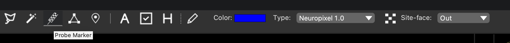

## Important things you need to know before you start

Locations and geometry of electrodes of Neuropixels 1.0 and 2.0 probes are pre-defined in HERBS. 

When ONLY atlas is loaded, the pre-surgery mode is ON.

When BOTH atlas and histological images are loaded, the after-surgery mode is ON.

Therefore, if users would like to plan the coordinates before surgeries, the histological images shoule not be loaded.

To work with probe related projects, 
the most important button one needs to know is <b style="font-size:120%; color:blue">Probe Marker</b> button.

After this button is checked, a group of sub-tools pop up: 
<b>Multi-shanks Switch</b> button, <b>Probe Color</b> selector, <b>Probe Type</b> combobox,
<b>Merge sites</b> button and <b>Sites Face Direction</b> combobox.

The Probe Type defines the geometry of a single shank of a probe.

For example, the current version of Neuropixels 2.0 is a 4-shnaks probe. Choosing <em>Neuropixel 2.0</em> 
in the <b>Probe Type</b> combobox will turn on the single shank Neuropixel 2.0.

To turn on the 4-shanks version, users need to switch <b>Multi-shanks Switch</b> button checked. 

The probe is considered to be a 3D rigid object and eletrodes are on one surface of the probe. 
When we clicked the trajectory of a probe, we assume the trajectory is the probe center.

The <b>Sites Face Direction</b> combobox is different for pre-planning (left) and after-reconstruction (right).

For pre-planning, the 'Out' indicates the electrodes facing to the users when looking at a 2D section window, 
whereas 'in' indicates the electrodes facing away from the users. 
'Left' and 'Right' indicates facing to the left-hand side and right-hand side of the section window.

For after-reconstruction, we consider only the relation between the user and the probe when he/she is doing the surgery.
So far we give 4 options depending on how users holding the probe when they are doing the surgery.

