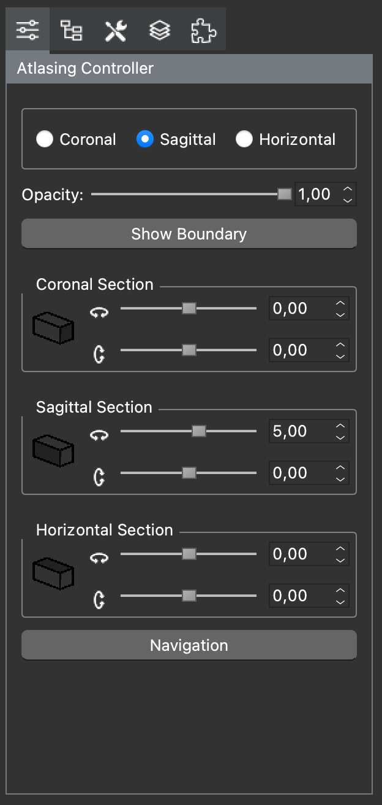
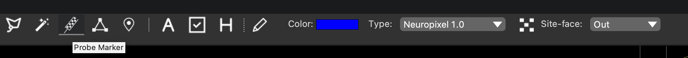
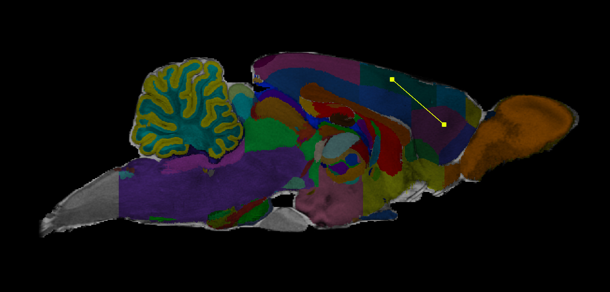

## Pre-Plan Neuropixels 1.0 Single Shank Probe

Locations and geometry of electrodes of Neuropixels 1.0 and 2.0 probes are pre-defined in HERBS. 
For the details for NP1.0, please check the Neuropixels 1.0 User Manual 
https://alleninstitute.org/media/filer_public/19/ff/19ff8b8b-9959-4944-a9c0-61006b4a0148/neuropixels_user_manual.pdf

To plan the probe coordinates before surgeries,

1. Load the desire atlas, here we use Waxholm Rat Atlas for illustration. Choose the section and rotate the plane if needed,

2. Click the <b>Probe Marker</b> tool button, 
change the <b>Probe Color</b> and <b>Site Face</b> if needed, 

3. Click at the desired location on the atlas window,

4. Add probe piece and merge probe. Please see the details in the corresponding tutorial.

A video tutorial:
See Turotial/Videos/pre_np1