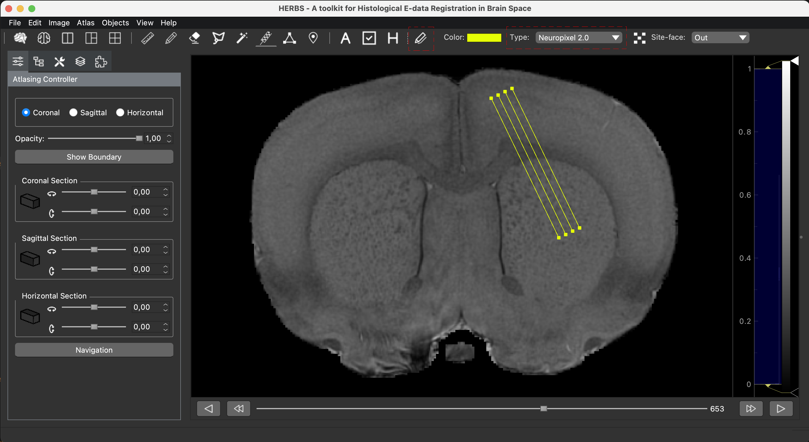

## Pre-Plan Neuropixels 2.0 Single Shank Probe and Multi-shanks Probe

Locations and geometry of electrodes of Neuropixels 1.0 and 2.0 probes are pre-defined in HERBS. 

To plan the probe coordinates before surgeries,

1. Load the desire atlas, here we use Waxholm Rat Atlas for illustration. 
Choose the section and rotate the plane if needed.

2. Click the <b>Probe Marker</b> tool button, 
select <em>Neuropixels 2.0</em> in the <b>Probe Type</b> combobox, 
check <b>Multi-shanks Switch</b> button to turn on the 4-shanks version and 
change <b>Site Face</b> if needed.

3. Click at the desired location on the atlas window,

4. Add probe piece and merge probe. Please see the details in the corresponding tutorial.
