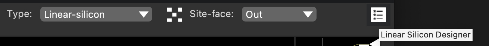
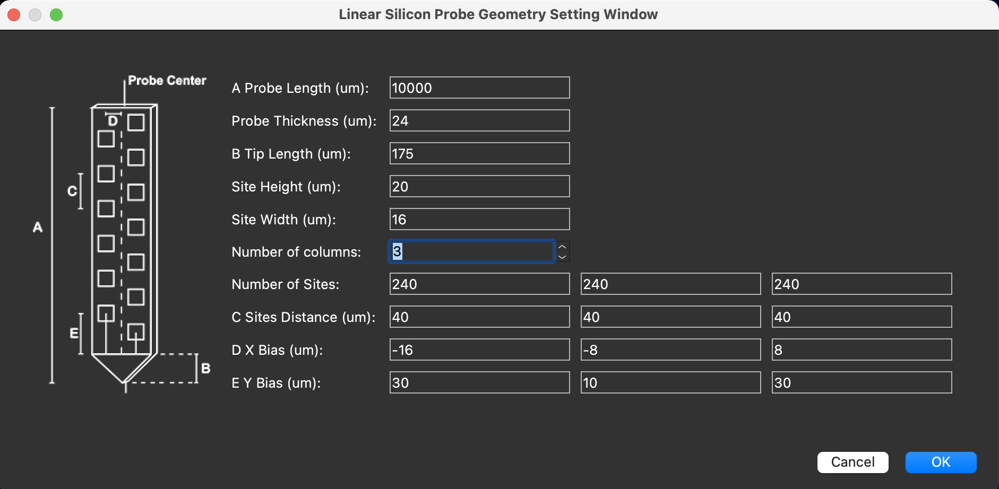

## Design the geometry of a Linear Silicon Probe 

In the latest version of HERBS, we provide user a flexible functionality to 
design the probe they would like to use other than Neuropixels 1.0 and Neuropixels 2.0.

1. After loading the atlas and click the <b>Probe Marker</b> tool button, 
select <em>Linear-silicon</em> in the <b>Probe Type</b> combobox. 
A <b>Linear Silicon Designer</b> button will pop up.

2. Click the <b>Linear Silicon Designer</b> button, the designer window will pop up. 
Design the probe you plan to use and press 'OK'.

