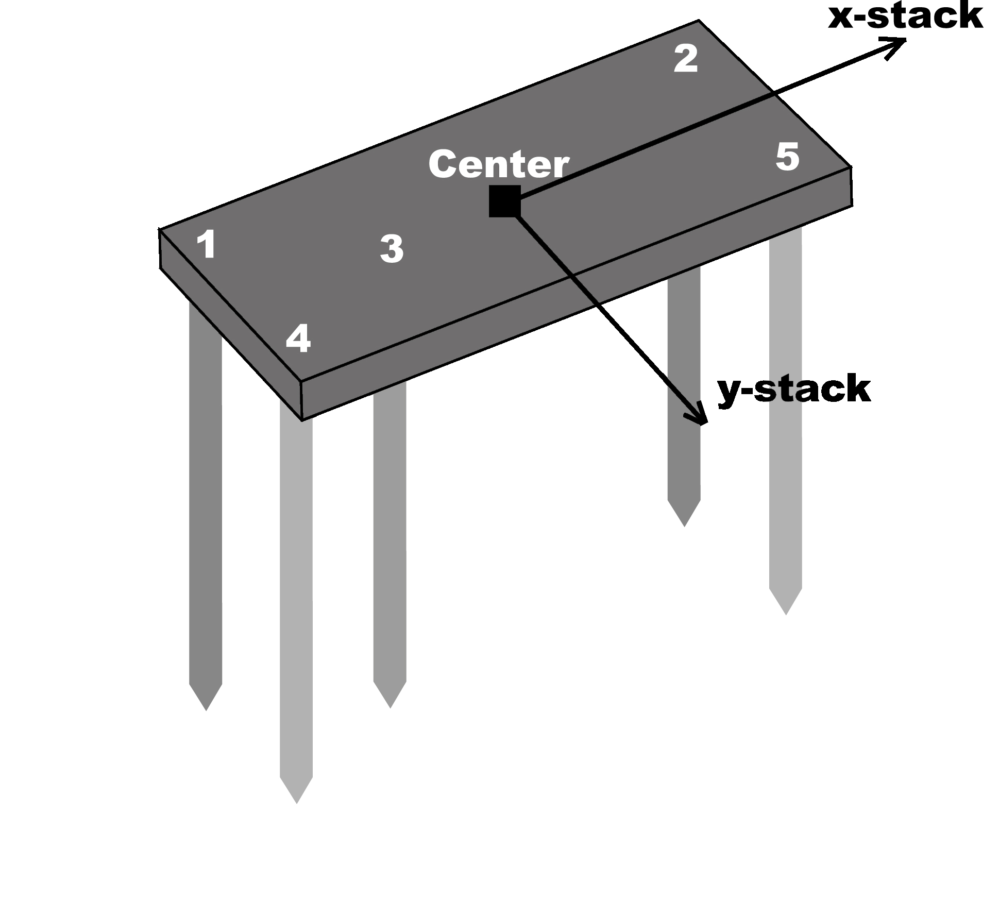
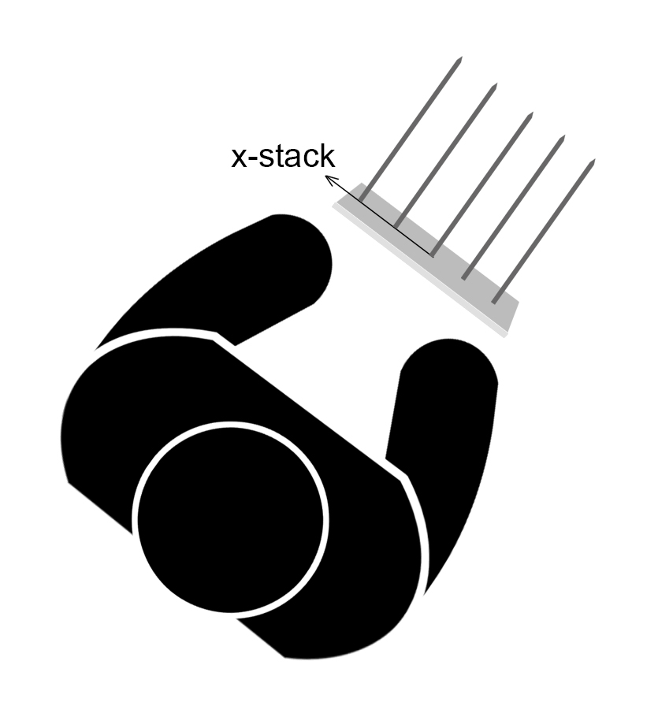
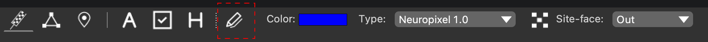
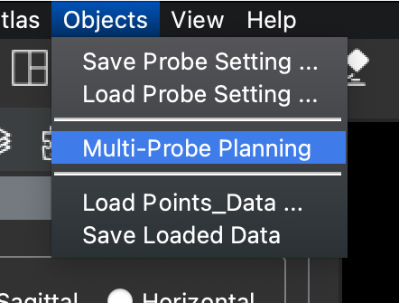
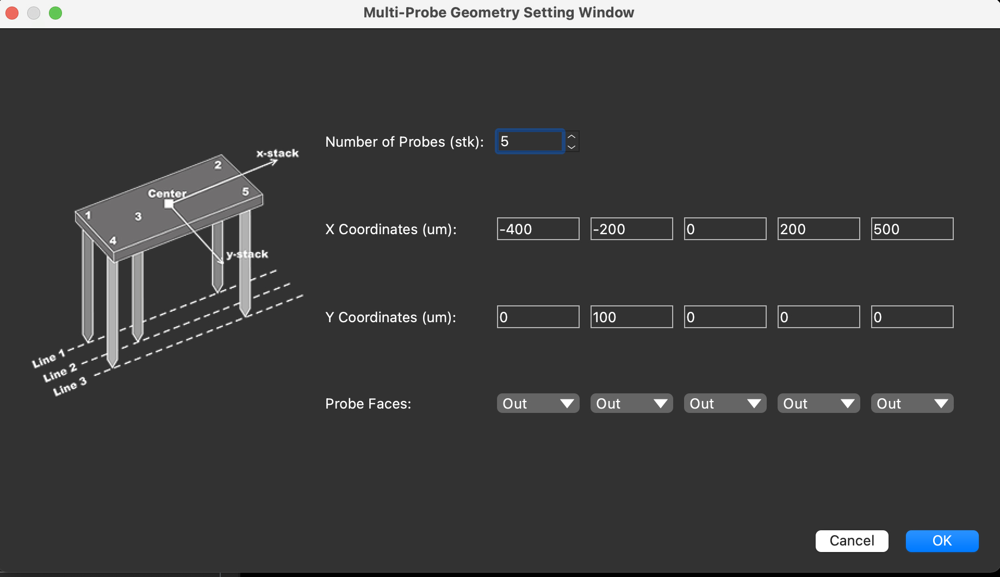
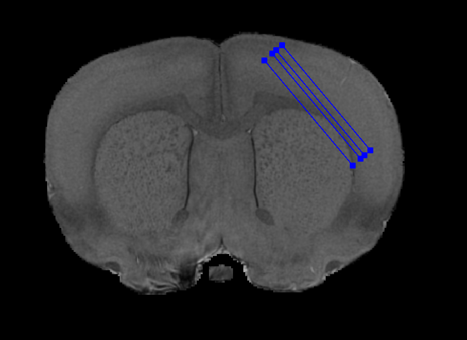
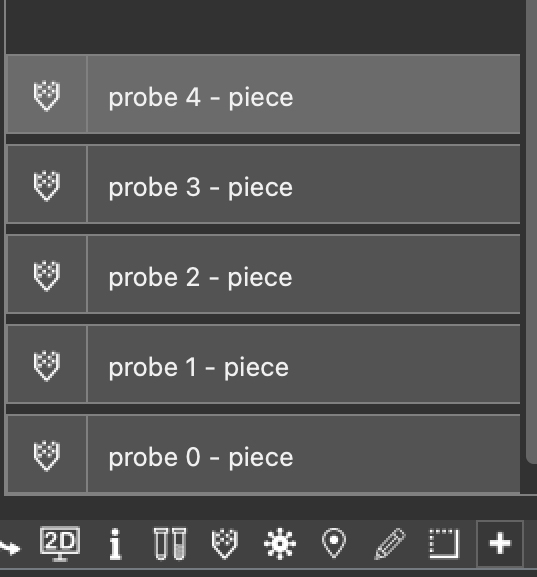

## Design the geometry for a multi-shanks probe 

In the latest version of HERBS, we provide user a flexible functionality to 
design for multi-shank probes.

A example of a multi-shanks probe is shown as follows,

For the pre-planing, the positive direction of y-stack is always 
assumed to be facing to the users who sit in front of the screen. 
That means, the positive y-stack is "Out", whereas the negative y-stack is 'In'.

For the after-surgery reconstruction, the positive of y-stack is always assumed to be "Up", as shown in the following figure,

### Pre-plan the probe

When using the multi-shanks mode and the mult-shanks probe settings is valid, 
the <b>Site Face Direction</b> combobox will have no effect on a single probe.

1. After loading the atlas and click the <b>Probe Marker</b> tool button, 
select the probe you would like to use and check the <b>Multi-shanks Switch</b> button. 
Here we use Neuropixels 1.0 probe for example.

2. Click the <b>Object</b> menu --> <b>Multi-Probe Planning</b> submenu, 
a designer window will pop up and an example is shown in the window.

3. Design the geometry for the probe, here we would like to have 5 probes/shanks, 
and 4 of them lie along the x-axis with y values to be 0. 
That means when we click the trajectories on the 2D section window, 4 lines will show up.

4. Click trajectories on Atlas section window.

5. Even though only 4 lines show up in the 2D window, when we add pieces, 5 probes will show up.

