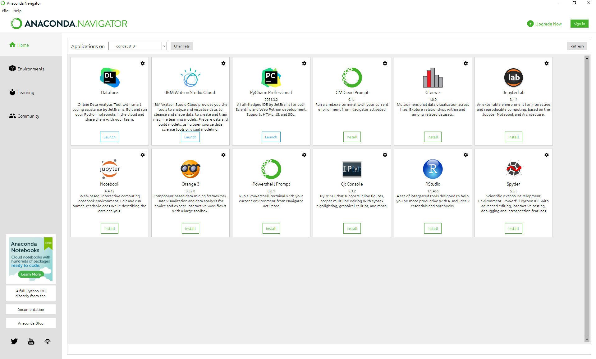
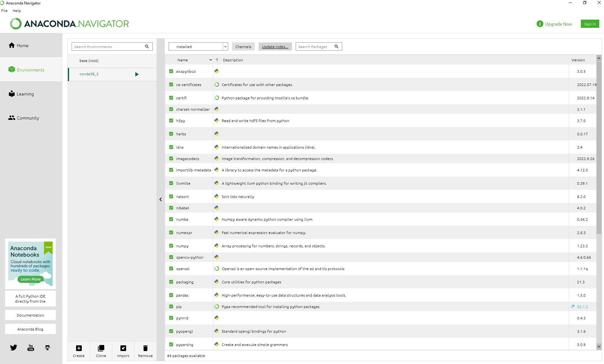

## Create Enviroment in Anaconda

Here we take Anaconda on Windows 10 for example. 

- After clicking Anaconda, a main window will show up. On the left panel, there are tabs for 'Home', 'Environments', 'Learning' and 'Community'. All available softwares are listed in the main area, and there is a 'Applications on' combobox on top. This combobox shows which enviroment you are using. e.g. I already chose an enviroment called 'conda38_3' in the screeshot. But when you start Anaconda, an enviroment called 'base' is the one shows there.

- To create a new enviroment, click 'Enviroments' tab. Before creating any new enviroments, you will only see 'base (root)' enviroment which has a small triangle arrow next to it. Click 'Creat' button on the bottom, a 'create new enviroment' window will popup. Enter a name for your desier enviroment and click 'create'. The screenshot shows an enviroment 'conda38_3' is created. Click the enviroment you would like to use and you will see the small triangle arrow move to the enviroment you clicked.

- Click the small triangle arrow to go to Terminal. Install or update the desired package in the Terminal. Click the 'Update index...' button on the top of pakcage list. You can check the versions of packages in the package list also.

