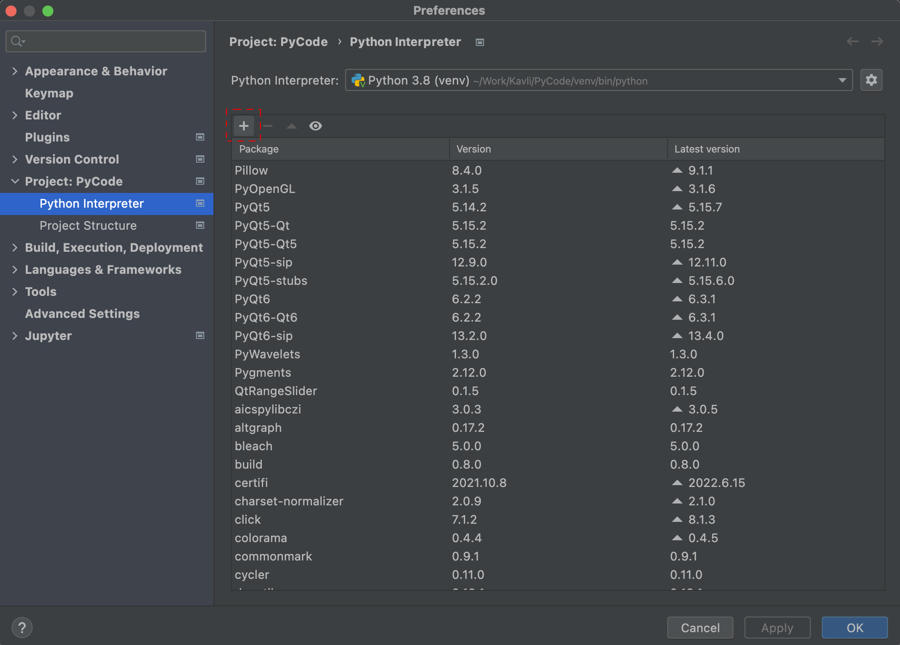
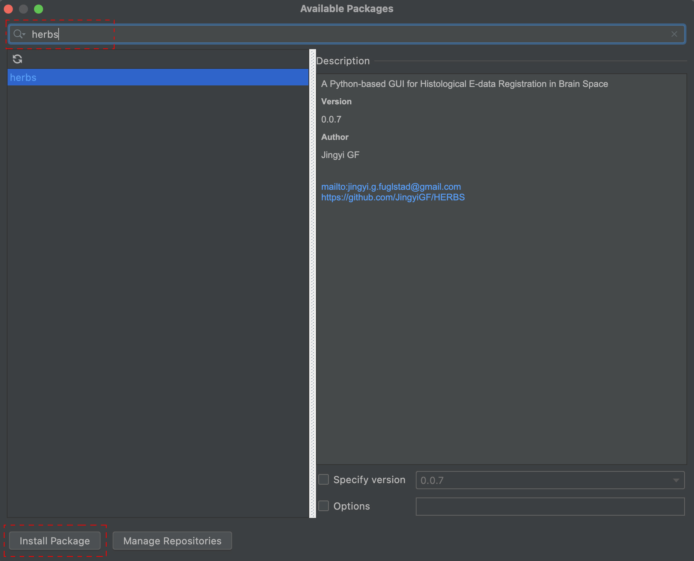

## Install HERBS through PyCharm

In this file, we will illustrate how to install herbs using PyCharm. Here we assume Python>=3.8.10
 < 3.11 and PyCharm is already installed.

If PyCharm is not installed, please install PyCharm first through (https://www.jetbrains.com/pycharm/). For more details about how to install and set up PyCharm (https://www.jetbrains.com/help/pycharm/installation-guide.html). For example,

- Create a Python project (https://www.jetbrains.com/help/pycharm/creating-empty-project.html)

- Install, uninstall, and upgrade packages (https://www.jetbrains.com/help/pycharm/installing-uninstalling-and-upgrading-packages.html)

<table>
<tr>
<th align="center">

 
<small>
Steps
</small>

</th>
<th align="center">

<small>
Results
</small>

</th>
</tr>
<tr>
<td>
<ul>
<li>Go to Python Interpreter  
	**File | Settings | Project | Python Interpreter** for Windows and Linux  
	**PyCharm | Preferences | Project | Python Interpreter** for macOS
	
And press the **+** button.
</li>
</ul>
</td>
<td align="center" width="50%">

</td>
</tr>
</tr>
<tr>
<td>
<ul>
<li>Type *herbs* and press *Install Package* button.
</li>
</ul>
</td>
<td align="center" width="50%">

</td>
</tr>

</table>

