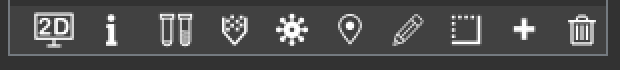

# Update Log

### 28th Oct. 2022
##### Major update! 
support for displaying merged object in 2D atlas view. Only merged probe is finished implementation at the moment. 

- By clicking **2D button**, the current activated merged objects will be displayed in the 2D atlas view. 
For probe objects, all three planes will be translated to the corresponding according to the insertion voxels,
and Coronal and Sagittal plane will be rotated according to the AP and ML angle respectively. 
The probe will be shown in both Coronal and Sagittal 2D atlas view.

- By clicking **info button**, the information window of the current activated object will pop up. 
The previous way to read the information by double clicking the object is no longer supported. 

### 29th Oct. 2022
##### Minor update!
Fix the atlas rotation slider value changed issue.

### 04th Nov. 2022
##### Minor debug.
Fix the valid values for the text input of on side points.